# aws-onprem-to-cloud-migration

Migrated a legacy on-premises Employee Directory application to AWS by implementing a secure and scalable two-tier architecture using Amazon EC2, Amazon RDS for MySQL, and AWS Database Migration Service (DMS). This project demonstrates application migration, database modernization, networking configuration, and migration cutover validation in a cloud environment.

---

## Project Overview

This project demonstrates the migration of a traditional on-premises Employee Directory application to AWS. The original environment consisted of a Linux-based application server and a locally managed MySQL database, creating challenges around scalability, availability, and operational maintenance.

To modernize the environment, I migrated the application to Amazon EC2, migrated the database to Amazon RDS for MySQL, and used AWS Database Migration Service (DMS) to perform database replication and migration.

---

## Architecture Diagram


---

## Solution Architecture

The migrated environment consists of:

- Amazon EC2 for application hosting
- Amazon RDS for MySQL database management
- AWS DMS for database migration and replication
- Amazon VPC for network isolation
- Security Groups for traffic control
- IAM for identity and access management

---

## Key Responsibilities

During this project, I:

- Deployed the application on Amazon EC2
- Migrated the MySQL database to Amazon RDS
- Configured AWS DMS replication tasks
- Implemented VPC networking and Security Groups
- Updated application configuration settings
- Performed migration testing and validation
- Executed the final migration cutover

---

## AWS Services Used

| Service | Purpose |
|----------|----------|
| Amazon EC2 | Application hosting |
| Amazon RDS (MySQL) | Managed relational database |
| AWS DMS | Database migration and replication |
| IAM | Identity and access management |
| VPC | Network isolation |
| Security Groups | Traffic filtering and access control |

---

## Outcome

By completing this project, I successfully:

- Migrated an on-premises application to AWS
- Deployed the application on Amazon EC2
- Migrated the database to Amazon RDS for MySQL
- Implemented secure networking and access controls
- Performed database replication using AWS DMS
- Validated application functionality after migration
- Delivered a fully operational cloud-hosted Employee Directory application

---

## Setting Up the Local On-Premises Environment

### Purpose

Before migrating the application to AWS, I deployed and validated the Employee Directory application in a local on-premises environment. This established a baseline environment that would later be migrated to AWS and served as a reference point for post-migration validation.

---

### Step 1: Install Node.js

I installed Node.js and npm to support the application backend and verified the installation by checking the installed versions.

```bash
node -v
npm -v
```

### Screenshot


---

### Step 2: Install and Configure MySQL

I installed MySQL Community Server and configured the local database environment required by the application.

This included:

* Creating the `employee_db` database
* Creating a dedicated application user
* Assigning database permissions
* Creating the `employees` table

### Screenshot


---

### Step 3: Download and Configure the Application

I cloned the application repository and installed all required dependencies.

```bash
git clone https://github.com/techwithlucy/ztc-projects.git

cd ztc-projects/projects/cloud-engineer-projects/project-1

npm install
```

### Screenshot


---

### Step 4: Configure Environment Variables

I created a `.env` file containing the application database connection details and runtime configuration.

---

### Step 5: Start the Application

After completing the configuration, I started the application and verified successful connectivity between the application and the MySQL database.

```bash
npm start
```

### Screenshot


---

### Step 6: Validate Application Functionality

After successfully starting the application, I accessed the Employee Directory web interface and performed functional testing by creating multiple employee records across different departments and locations.

This validation confirmed that the application was functioning correctly and that employee data was being successfully stored in the MySQL database.

### Screenshot


---

### Outcome

At the end of this phase, I successfully:
- Deployed the application in a local on-premises environment
- Configured and connected the MySQL database
- Verified successful application-to-database connectivity
- Created and stored employee records in the database
- Validated application functionality and data persistence
- Established the baseline environment for migration to AWS

---

## Simulated On-Premises Server on Amazon EC2

### Objective

I deployed the Employee Directory application and MySQL database on an Ubuntu EC2 instance to create a Linux-based simulated on-premises environment.

This environment will serve as the source workload for the upcoming database migration to Amazon RDS using AWS Database Migration Service (DMS).

---

### Step 1: Launch and Configure the EC2 Instance

I launched an Ubuntu EC2 instance to host the Employee Directory application and MySQL database.

I configured:

* Ubuntu Server 24.04 LTS
* Public IPv4 connectivity
* SSH access for server administration
* TCP port `3000` for application access
* Security Group rules to control inbound traffic

### Screenshot

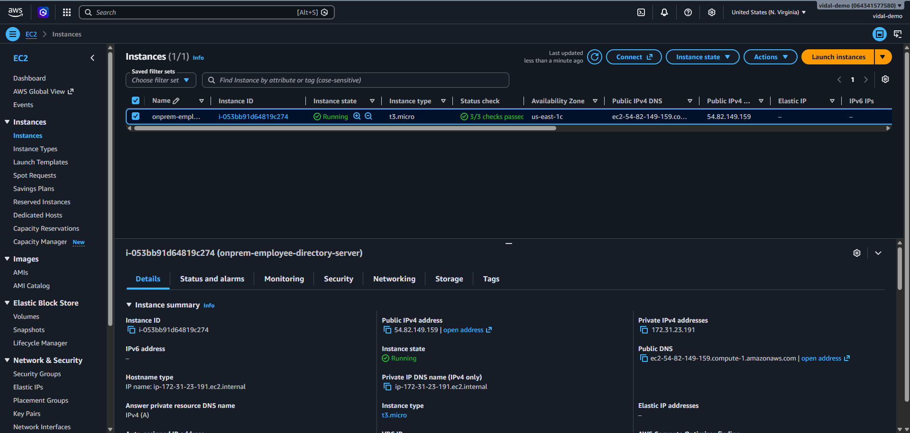

**Capture:** The EC2 console showing the instance in the **Running** state. Include the instance name, instance type, and status.

---

### Step 2: Connect to the EC2 Instance

I connected to the Ubuntu EC2 instance using SSH to perform the server configuration and application deployment.

```bash
ssh -i your-key.pem ubuntu@<EC2_PUBLIC_IP>
```

I then installed and verified Node.js, npm, and Git to prepare the server for the Employee Directory application.

```bash
node -v
npm -v
git --version
```

### Screenshot

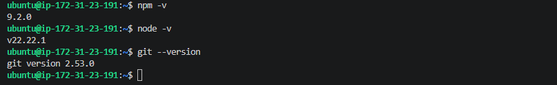


**Capture:** The SSH terminal showing the successful connection and the Node.js, npm, and Git versions.

---

### Step 3: Configure MySQL on EC2

I installed and configured MySQL Server on the EC2 instance to provide the database layer for the Employee Directory application.

I created:

* `employee_db` database
* `employee_user` application account
* Required database privileges
* `employees` table

I verified the database configuration using:

```sql
SHOW DATABASES;
USE employee_db;
SHOW TABLES;
```

### Screenshot

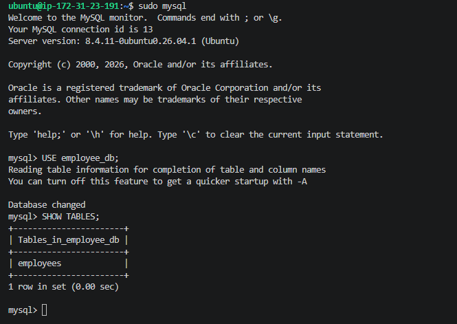

**Screenshot filename:** `08-ec2-mysql-database.png`

**Capture:** The MySQL terminal showing that `employee_db` exists and `SHOW TABLES;` returns the `employees` table.

---

### Step 4: Deploy the Employee Directory Application

I cloned the Employee Directory application onto the EC2 instance and installed the required Node.js dependencies.

```bash
git clone https://github.com/techwithlucy/ztc-projects.git

cd ztc-projects/projects/cloud-engineer-projects/project-1

npm install
```

I then configured the application environment variables to connect the Node.js backend to the MySQL database running on the EC2 instance.

---

### Step 5: Start the Application on EC2

I started the Node.js application and verified that it successfully connected to the MySQL database.

```bash
npm start
```

### Screenshot

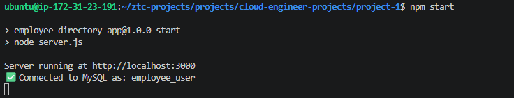

**Screenshot filename:** `09-ec2-application-startup.png`

**Capture:** The terminal showing both the application server running on port `3000` and the successful MySQL connection.

For example:

```text
Server running at http://localhost:3000
Connected to MySQL as: employee_user
```

---

### Step 6: Validate Application Functionality

I accessed the Employee Directory application remotely through the EC2 instance and created multiple employee records to validate application functionality and database persistence.

This confirmed that:

* The application was successfully running on EC2
* The application was remotely accessible
* The Node.js backend successfully connected to MySQL
* Employee records could be created and retrieved
* Employee data persisted in the MySQL database

### Screenshot

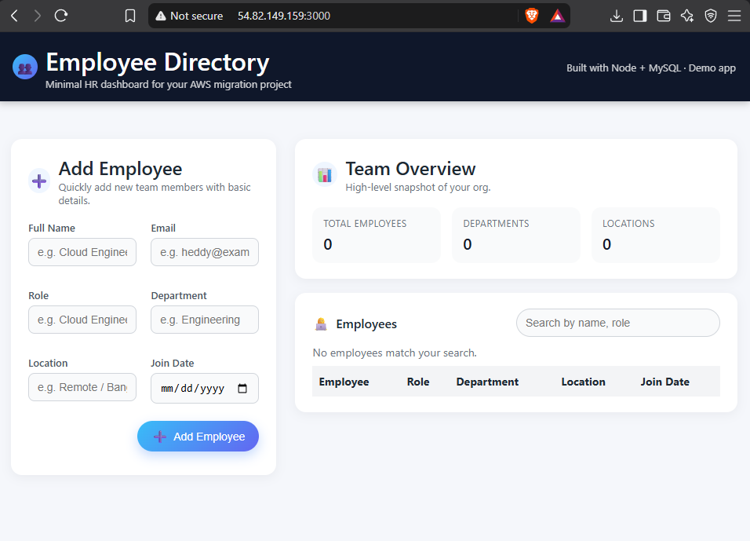

**Screenshot filename:** `10-ec2-employee-directory.png`

**Capture:** My browser showing the Employee Directory running from the EC2 instance with several employee records visible.

---

### Outcome

At the end of this phase, I successfully:

* Provisioned an Ubuntu EC2 instance
* Configured network access using Security Groups
* Installed the required application runtime and dependencies
* Installed and configured MySQL Server
* Deployed the Employee Directory application
* Established application-to-database connectivity
* Validated remote application access and data persistence
* Established the EC2-hosted MySQL database as the source environment for the upcoming AWS DMS migration

The next phase will migrate the MySQL database from this simulated on-premises environment to Amazon RDS for MySQL using AWS Database Migration Service (DMS).

---

## 1.4 Set Up Amazon RDS (Target Database)

### Objective

I created an **Amazon RDS MySQL database** to serve as the target database for the Employee Directory migration.

The MySQL database running on my simulated on-premises EC2 server will serve as the **source database**, while Amazon RDS will serve as the **target database** for the upcoming migration using **AWS Database Migration Service (DMS)**.

---

### Step 1: Create the RDS MySQL Instance

I created a new Amazon RDS database using the MySQL engine.

I configured the database with:

- **Database creation method:** Standard create
- **Engine:** MySQL
- **DB instance identifier:** `employee-db-rds`
- **Master username:** `admin`
- **Storage:** General Purpose SSD

### Screenshot

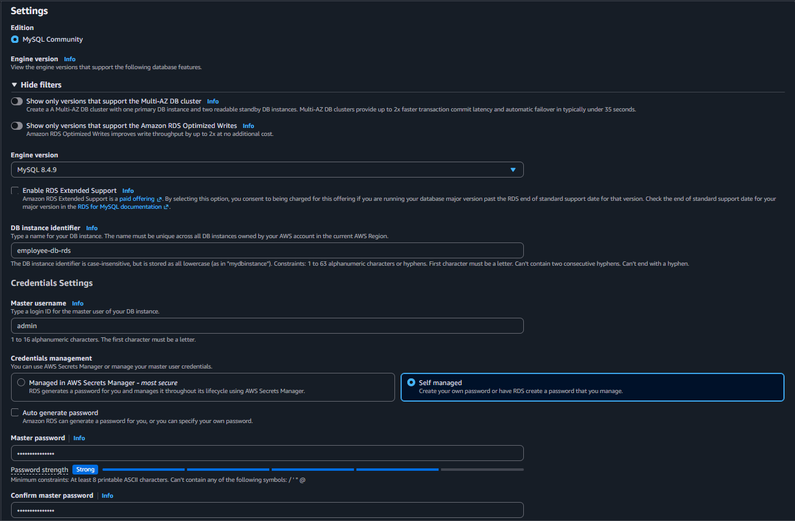

---

### Step 2: Configure RDS Connectivity

I configured the RDS instance within the **default VPC** so that it could communicate with the simulated on-premises EC2 environment.

I also created a dedicated Security Group:

```text
rds-mysql-sg
```

This Security Group controls inbound MySQL traffic to the RDS instance.

### Screenshot

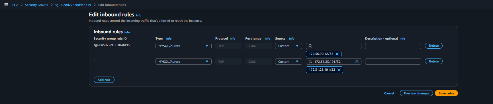

---

### Step 3: Provision the RDS Database

After completing the database and networking configuration, I created the RDS instance and waited for it to reach the `Available` state.

This confirmed that the managed MySQL database was successfully provisioned and ready for additional configuration.

### Screenshot

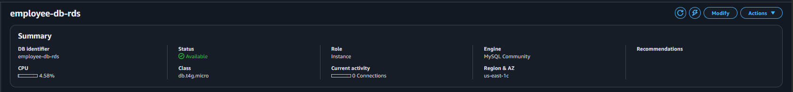

---

### Step 4: Configure MySQL Network Access

I configured the `rds-mysql-sg` Security Group to allow MySQL communication from the simulated on-premises EC2 server.

The inbound rule was configured with:

- **Type:** MySQL/Aurora
- **Protocol:** TCP
- **Port:** `3306`
- **Source:** Restricted to the required EC2 source environment

This allows the source environment to communicate with the RDS MySQL database while avoiding unrestricted database access.

### Screenshot

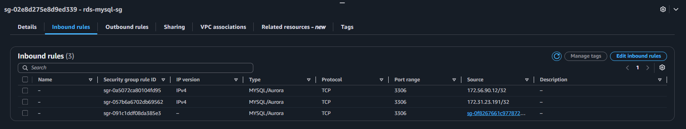

---

### Step 5: Retrieve the RDS Endpoint

After the RDS instance became available, I retrieved the database endpoint from the **Connectivity & security** section.

The endpoint will be used during the AWS DMS migration and later when configuring the Employee Directory application to connect to the RDS database.

### Screenshot

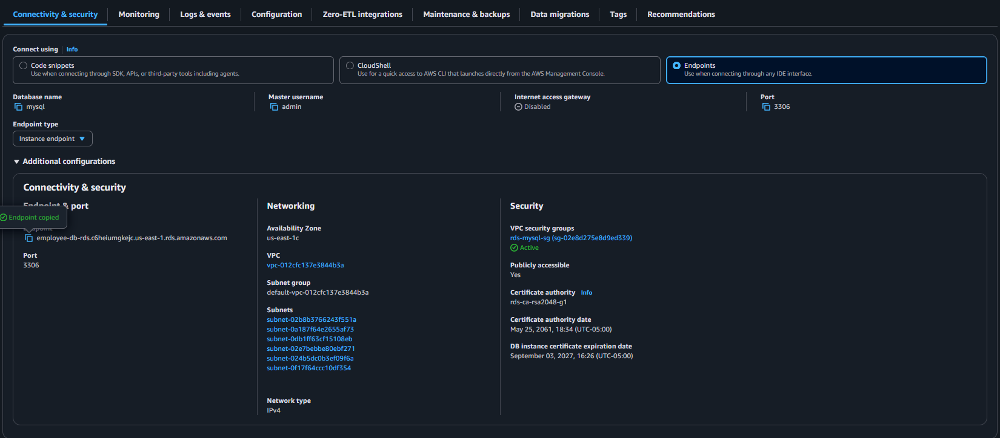

---

### Outcome

At the end of this phase, I successfully:

- Provisioned an **Amazon RDS MySQL** instance
- Established RDS as the **target database**
- Configured VPC connectivity
- Created a dedicated RDS Security Group
- Configured MySQL access on port `3306`
- Verified that the RDS instance reached the `Available` state
- Retrieved the RDS endpoint for the upcoming database migration

The RDS target database is now ready for the next phase, where I will use **AWS Database Migration Service (DMS)** to migrate the Employee Directory data from the simulated on-premises MySQL database to Amazon RDS.

---

## 1.5 Set Up AWS DMS for Database Migration

### Objective

I configured **AWS Database Migration Service (DMS)** to migrate the Employee Directory MySQL database from the simulated on-premises EC2 environment to **Amazon RDS for MySQL**.

The migration architecture uses the EC2-hosted MySQL database as the **source** and Amazon RDS MySQL as the **target**.

```text
EC2 MySQL (Source)
        |
        | TCP 3306
        v
AWS Database Migration Service
        |
        | TCP 3306
        v
Amazon RDS MySQL (Target)
```

---

### Step 1: Create the DMS Replication Instance

I created a DMS replication instance to provide the compute resources required to perform the database migration.

I configured the replication instance with:

- **Name:** `ztc-migration-instance`
- **Instance class:** `dms.t3.micro`
- **Deployment:** Single-AZ
- **Environment:** Development/Test
- **VPC:** Same VPC used by the EC2 source and RDS target

The replication instance acts as the migration engine between the source and target databases.

### Screenshot

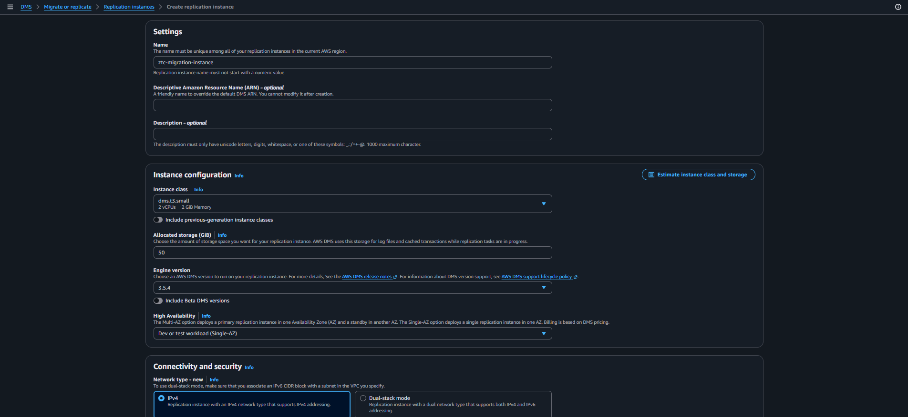

---

### Step 2: Configure the Source Endpoint

I created a DMS source endpoint representing the MySQL database running on the simulated on-premises EC2 server.

The source endpoint was configured with:

- **Endpoint identifier:** `source-ec2-mysql`
- **Engine:** MySQL
- **Server:** EC2 private IP address
- **Port:** `3306`
- **Database user:** `employee_user`
- **SSL mode:** None

I also configured the EC2 Security Group to allow MySQL traffic from the Security Group associated with the DMS replication instance.

```text
MySQL/Aurora
TCP 3306
Source: DMS Replication Instance Security Group
```

This allows DMS to securely reach the MySQL source database without exposing MySQL to unrestricted inbound traffic.

### Screenshot

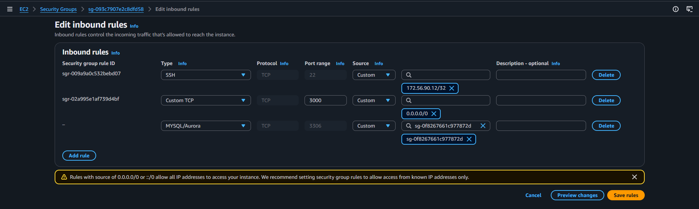

I tested the DMS source endpoint connection and verified that the replication instance could successfully communicate with the EC2-hosted MySQL database.

### Screenshot

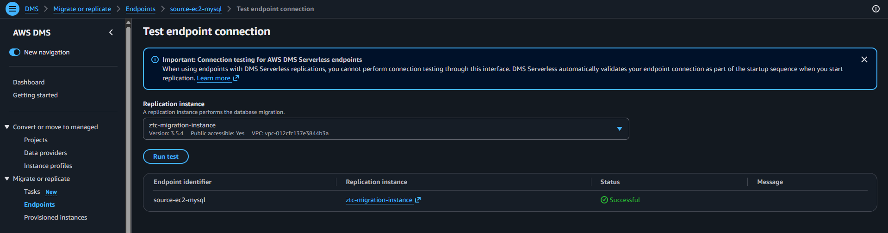

---

### Step 3: Configure the Target Endpoint

I created a DMS target endpoint representing the Amazon RDS MySQL database.

The target endpoint was configured with:

- **Endpoint identifier:** `target-rds-mysql`
- **Engine:** MySQL
- **Server:** Amazon RDS endpoint
- **Port:** `3306`
- **Database user:** `admin`
- **SSL mode:** None

I updated the RDS Security Group to allow MySQL traffic from the DMS replication instance Security Group.

```text
MySQL/Aurora
TCP 3306
Source: DMS Replication Instance Security Group
```

I then tested the target endpoint connection and confirmed that DMS could successfully communicate with Amazon RDS.

### Screenshot


---

### Step 4: Create the DMS Migration Task

After successfully testing both endpoints, I created a DMS migration task to move the Employee Directory database from EC2 MySQL to Amazon RDS MySQL.

I configured the task with:

- **Task identifier:** `ec2-to-rds-migration`
- **Task mode:** Provisioned
- **Replication instance:** `ztc-migration-instance`
- **Source endpoint:** `source-ec2-mysql`
- **Target endpoint:** `target-rds-mysql`
- **Migration type:** Migrate existing data

I configured the table mapping to include the Employee Directory database and its tables.

```text
Schema: employee_db
Table: %
Action: Include
```

The `%` wildcard instructs DMS to include all tables within the `employee_db` schema.

### Screenshot

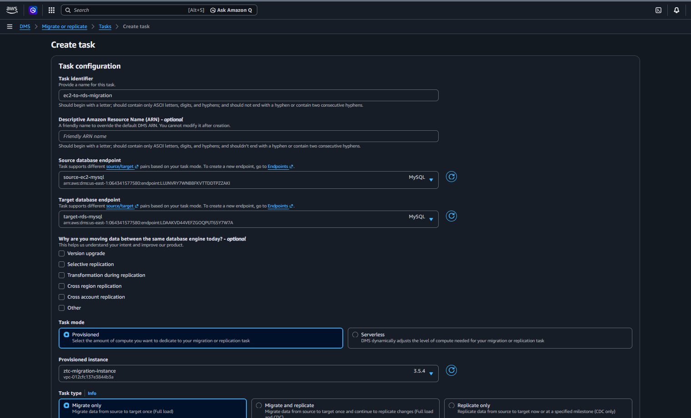

---

### Step 5: Run the Database Migration

I started the DMS migration task, allowing AWS DMS to connect to the EC2 MySQL source database, read the selected tables, and load them into Amazon RDS MySQL.

After the migration completed, I verified that the DMS task reported a successful full load.

### Screenshot

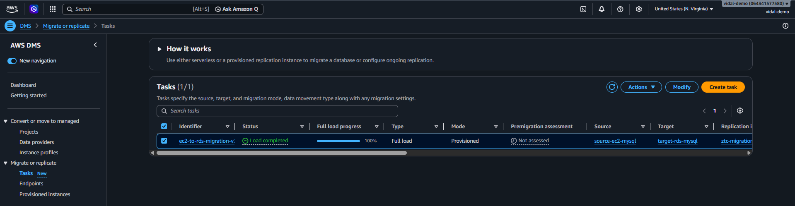

---

### Step 6: Verify the Migrated Data in Amazon RDS

After the DMS migration completed, I connected to the Amazon RDS MySQL database and verified that the Employee Directory records were successfully migrated.

I connected to RDS using the MySQL client:

```bash
mysql -h <RDS_ENDPOINT> -u admin -p
```

I then queried the migrated database:

```sql
USE employee_db;

SELECT * FROM employees;
```

The query returned the employee records that previously existed in the EC2-hosted MySQL database, confirming that the migration completed successfully.

### Screenshot

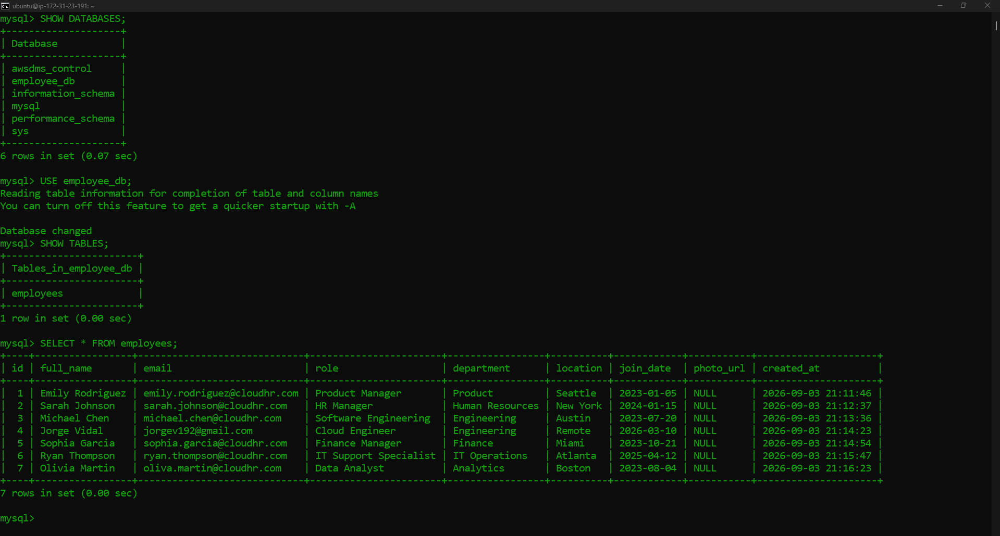

---

### Outcome

At the end of this phase, I successfully:

- Provisioned an AWS DMS replication instance
- Configured EC2 MySQL as the source endpoint
- Configured Amazon RDS MySQL as the target endpoint
- Implemented Security Group rules for database connectivity
- Successfully tested both DMS endpoints
- Created a DMS full-load migration task
- Migrated the `employee_db` database from EC2 MySQL to Amazon RDS
- Verified that the employee records were successfully migrated

The database migration from the simulated on-premises environment to Amazon RDS is now complete.

The next phase will update the Employee Directory application to use **Amazon RDS MySQL** instead of the MySQL database running locally on the EC2 source server.

---
