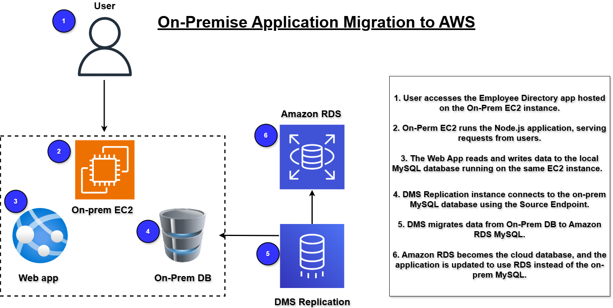

# aws-onprem-to-cloud-migration
Migrated an on-prem Employee Directory application to AWS using EC2, Amazon RDS, and AWS DMS. Implemented secure networking, database migration, and application cutover testing to build a scalable cloud-native architecture with high availability and improved reliability.

# aws-onprem-to-cloud-migration

### Project Overview

In this project, I migrated an on-premises Employee Directory Web Application to AWS using a scalable and cloud-native architecture. The original application was hosted on a single Linux server with a local MySQL database, which created several operational and scalability challenges as the company expanded.

I designed and implemented a two-tier AWS architecture using Amazon EC2 for the application layer and Amazon RDS for the database layer. I also used AWS Database Migration Service (DMS) to replicate and migrate the MySQL database from the on-premises environment into AWS.

This project demonstrates real-world cloud migration practices including infrastructure deployment, database migration, networking configuration, security implementation, testing, and migration cutover.

---

### Scenario

CloudHR Systems is a growing HR software provider that relies on an internal Employee Directory Web Application to manage:

- Employee profiles
- Departments
- Roles
- Employee documents

The environment was originally hosted on a single on-premises Linux server running:

- Application backend
- Local MySQL database

As the company expanded across multiple office locations, the infrastructure began experiencing several issues:

- Frequent server downtime
- Storage limitations
- Poor scalability
- Increased maintenance overhead
- Risk of data loss due to lack of redundancy

To improve reliability, scalability, and long-term operational efficiency, I migrated the application and database infrastructure to AWS.

---

### My Role as the Cloud Engineer

As the Cloud Engineer for this project, I was responsible for performing a complete migration of the Employee Directory Application from the on-premises environment to AWS.

My responsibilities included:

- Migrating the application backend to Amazon EC2
- Migrating the MySQL database to Amazon RDS
- Using AWS DMS for database replication and migration
- Configuring networking and security
- Updating application configurations
- Performing migration testing and validation
- Completing the final migration cutover

---

### About the Project

In this hands-on cloud migration project, I:

- Set up and ran the Employee Directory Application locally
- Deployed the application backend on Amazon EC2
- Migrated the MySQL database into Amazon RDS using AWS DMS
- Performed migration testing and cutover validation

By completing this project, I successfully deployed a fully functional cloud-hosted Employee Directory Application running entirely on AWS.

This project also serves as a professional portfolio project demonstrating practical cloud migration experience.

---

### Project Steps

The following migration phases were completed during this project:

1. Set up the local “on-premises” application
2. Migrated the application server to Amazon EC2
3. Migrated the database to Amazon RDS using AWS DMS
4. Updated application configurations and performed testing
5. Completed the final migration cutover

---

### AWS Services Used

| Service | Purpose |
|---|---|
| Amazon EC2 | Hosted the application backend |
| Amazon RDS (MySQL) | Managed relational database service |
| AWS DMS | Database migration and replication |
| IAM | Identity and access management |
| VPC | Network isolation and infrastructure |
| Security Groups | Controlled inbound and outbound traffic |
| Subnets | Organized AWS network resources |

---

### Architecture Diagram

---

### Final Result

At the end of this project, I successfully achieved the following:

- Deployed the Employee Directory Application on Amazon EC2
- Migrated the MySQL database to Amazon RDS (MySQL)
- Configured secure AWS networking and access controls
- Performed successful database migration using AWS DMS
- Completed application testing and migration cutover
- Built a fully functional cloud-hosted Employee Directory Application running on AWS

---
