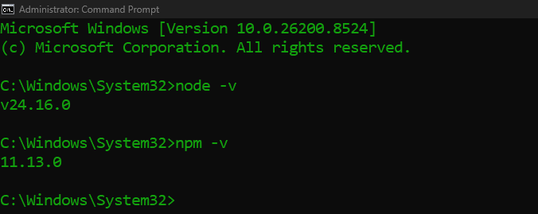
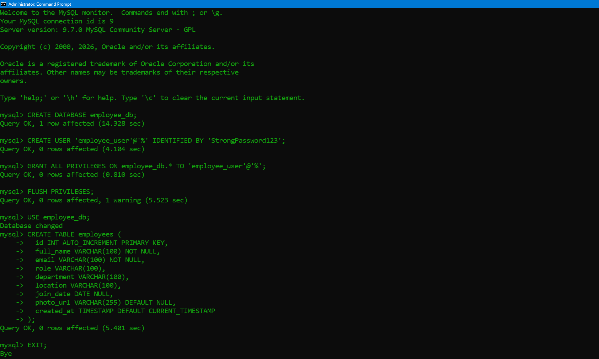
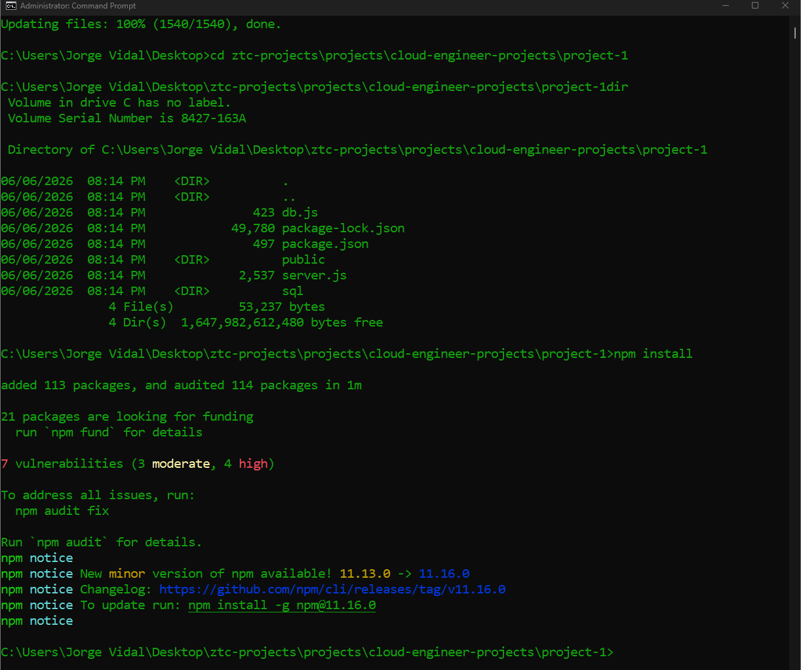
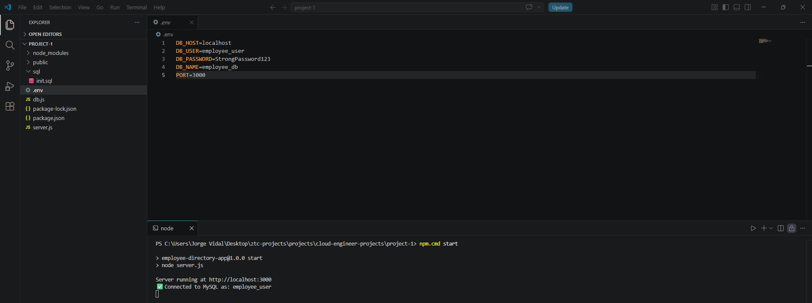
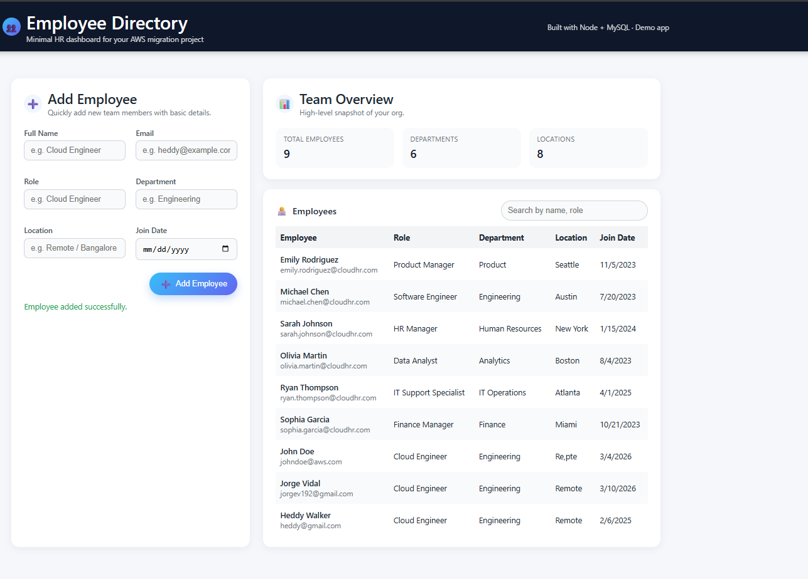

# aws-onprem-to-cloud-migration

Migrated a legacy on-premises Employee Directory application to AWS by implementing a secure and scalable two-tier architecture using Amazon EC2, Amazon RDS for MySQL, and AWS Database Migration Service (DMS). This project demonstrates application migration, database modernization, networking configuration, and migration cutover validation in a cloud environment.

---

## Project Overview

This project demonstrates the migration of a traditional on-premises Employee Directory application to AWS. The original environment consisted of a Linux-based application server and a locally managed MySQL database, creating challenges around scalability, availability, and operational maintenance.

To modernize the environment, I migrated the application to Amazon EC2, migrated the database to Amazon RDS for MySQL, and used AWS Database Migration Service (DMS) to perform database replication and migration.

---

## Architecture Diagram


---

## Solution Architecture

The migrated environment consists of:

- Amazon EC2 for application hosting
- Amazon RDS for MySQL database management
- AWS DMS for database migration and replication
- Amazon VPC for network isolation
- Security Groups for traffic control
- IAM for identity and access management

---

## Key Responsibilities

During this project, I:

- Deployed the application on Amazon EC2
- Migrated the MySQL database to Amazon RDS
- Configured AWS DMS replication tasks
- Implemented VPC networking and Security Groups
- Updated application configuration settings
- Performed migration testing and validation
- Executed the final migration cutover

---

## AWS Services Used

| Service | Purpose |
|----------|----------|
| Amazon EC2 | Application hosting |
| Amazon RDS (MySQL) | Managed relational database |
| AWS DMS | Database migration and replication |
| IAM | Identity and access management |
| VPC | Network isolation |
| Security Groups | Traffic filtering and access control |

---

## Outcome

By completing this project, I successfully:

- Migrated an on-premises application to AWS
- Deployed the application on Amazon EC2
- Migrated the database to Amazon RDS for MySQL
- Implemented secure networking and access controls
- Performed database replication using AWS DMS
- Validated application functionality after migration
- Delivered a fully operational cloud-hosted Employee Directory application

---

## Setting Up the Local On-Premises Environment

### Purpose

Before migrating the application to AWS, I deployed and validated the Employee Directory application in a local on-premises environment. This established a baseline environment that would later be migrated to AWS and served as a reference point for post-migration validation.

---

### Step 1: Install Node.js

I installed Node.js and npm to support the application backend and verified the installation by checking the installed versions.

```bash
node -v
npm -v
```

### Screenshot



---

### Step 2: Install and Configure MySQL

I installed MySQL Community Server and configured the local database environment required by the application.

This included:

* Creating the `employee_db` database
* Creating a dedicated application user
* Assigning database permissions
* Creating the `employees` table

### Screenshot



---

### Step 3: Download and Configure the Application

I cloned the application repository and installed all required dependencies.

```bash
git clone https://github.com/techwithlucy/ztc-projects.git

cd ztc-projects/projects/cloud-engineer-projects/project-1

npm install
```

### Screenshot



---

### Step 4: Configure Environment Variables

I created a `.env` file containing the application database connection details and runtime configuration.

---

### Step 5: Start the Application

After completing the configuration, I started the application and verified successful connectivity between the application and the MySQL database.

```bash
npm start
```

### Screenshot



---

### Step 6: Validate Application Functionality

I accessed the Employee Directory application through the browser and created sample employee records to verify application functionality and database persistence.

### Screenshot



---

### Outcome

At the end of this phase, I successfully:

* Deployed the application in a local on-premises environment
* Configured a MySQL database and application user
* Validated database connectivity
* Verified application functionality
* Established the baseline environment for migration to AWS

---

